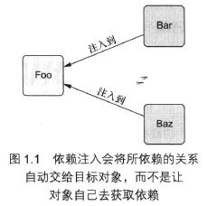

# [Spring实战（第4版）](../../../../)

## [第1部分 Spring的核心](../../../)

### [第1章 Spring之旅](../../)

#### [1.1 简化Java开发](../)

##### 1.1.2 依赖注入

**DI功能是如何实现的**

任何一个有实际意义的应用（肯定比Hello World示例更复杂）都会由两个或者更多的类组成，这些类互相之间进行协作来完成特定的业务逻辑。按照传统的做法，每个对象负责管理与自己相互协作的对象（即它所依赖的对象）的引用，这将会导致高度耦合和难以测试的代码

> 程序清单1.2 DamselRescuingKnight只能执行RescueDamselQuest探险任务
```Java
package com.springinaction.knights;

public class DamselRescuingKnight implements Knight {
    private RescueDamselQuest quest;

    public DamselRescuingKnight() {
        this.quest = new RescueDamselQuest(); // 与RescueDamselQuest紧耦合
    }

    public void embarkOnQuest() {
        quest.emback();
    }
}
```

上面的代码会使单元测试出奇的困难，在这样的一个测试中，你必须保证当embarkOnQuest()方法被调用的时候，探险的emback()方法也要被调用。

**耦合具有两面性（two-headed beast）。一方面，紧密耦合的代码难以测试、难以复用、难以理解，并且典型地表现出“打地鼠”式的bug特性（修复一个bug，将会出现一个或者更多新的bug）。另一方面，一定程度的耦合又是必须的——完全没有耦合的代码什么也做不了。为了完成有实际意义的功能，不同的类必须以适当的方式进行交互。总而言之，耦合是必须的，但应当被小心谨慎地管理。**

通过DI，对象的依赖关系将由系统中负责协调各对象的第三方组件进行创建对象的时候进行设定。对象无需自行创建或管理它们的依赖关系，如图1.1所示，依赖关系将被自动注入到需要它们的对象当中去。



改进后代码如1.3所示

> 程序清单1.3 BraveKnight足够灵活可以接受任何赋予他的探险任务
```Java
package com.springinaction.knights;

public class BraveKnight implements Knight {
    private Quest quest;

    public BraveKnight(Quest quest) {
        this.quest = quest; // Quest被注入进来
    }

    public void embarkOnQuest() {
        quest.emback();
    }
}
```

上面的代码没有自行创建探险任务，而是在构造的时候把探险任务作为参数传入。**这是依赖注入的方式之一，构造器注入（constructor injection）**

更重要的是，传入的探险类型的Quest，也就是所有的探险任务都必须实现的一个接口。所以BraveKnight能响应任意的Quest实现

这里的要点是BraveKnight没有与任何特性的Quest发生耦合。对它来说，被要求挑战的探险任务只要是实现了Quest接口，那么具体是哪种探险就无关紧要了。**这就是DI所带来的最大的收益——松耦合。**如果一个对象只通过接口（而不是具体实现或初始化过程）来表明依赖关系，那么这种依赖就能够在对象本身毫不知情的情况下，用不同的具体实现进行替换。

下面使用mock测试BraveKnight

> 程序清单1.4 为了测试BraveKnight，需要注入一个mock Quest
```Java
package com.springinaction.knights;
import static org.mockito.Mockito.*;
import org.junit.Test;

public class BraveKnightTest {
    
    @Test
    public void knightShouldEmbarkOnQuest() {
        Quest mockQuest = mock(Quest.class);// 创建mock Quest
        BraveKnight knight = new BraveKnight(mockQuest);// 注入mock Quest
        knight.embarkOnQuest();
        verify(mockQuest, times(1)).embark();
    }

}
```

可以使用mock框架Mockito去创建一个Quest接口的mock实现。通过这个mock对象，就可以创建一个新的BraveKnight实例，并通过构造器注入这个mock Quest。当调用embarkOnQuest()方法时，可以要求Mockito框架验证Quest的mock实现的embark()方法仅仅被调用了一次。

**将Quest注入到Knight中**

假设希望BraveKnight要进行的探险任务时杀死一只怪龙

> 程序清单1.5 SlayDragonQuest是要注入到BraveKnight中的Quest实现
```Java
package com.springinaction.knights;

import java.io.PrintStream;

public class SlayDragonQuest implements Quest {

    private PrintStream stream;
    
    public SlayDragonQuest(PrintStream stream) {
        this.stream = stream;
    }
    
    public void embark() {
        stream.println("Embarking on quest to slay the dragon!");
    }

}
```

SlayDragonQuest实现了Quest接口，它适合注入到BraveKnight。那么如何将SlayDragonQuest交给BraveKnight呢？如何将PrintStream交给SlayDragonQuest呢？

创建应用组件之间写作的行为称为装配（wiring）。Spring有多种装配bean的方式，采用XML时很常见的一种装配方式。程序清单1.6展现了一个简单的Spring配置文件：knights.xml，该文件将BraveKnight、SalyDragonQuest和PrintStream装配到了一起。

> 程序清单1.6 使用Spring将SlayDragonQuest注入到BraveKnight中
```xml
<?xml version="1.0" encoding="UTF-8">
<beans xmlns="http://www.springframework.org/schema/beans" xmlns:xsi="http://www.w3.org/2001/XMLSchema-instance" xsi:schemaLocation="http://www.springframework.org/schema/beans https://www.springframework.org/schema/beans/spring-beans.xsd">
    <bean id="knight" class="com.springinaction.knights.BraveKnight">
        <!-- 注入Quest bean -->
        <constructor-arg ref="quest" /> 
    </bean>
    <bean id="quest" class="com.springinaction.knights.SlayDragonQuest">
        <!-- 创建SlayDragonQuest -->
        <constructor-arg value="#{T(System).out)}" />
    </bean>
</beans>
```

在这里，BraveKnight和SlayDragonQuest被声明为Spring中的bean。就BraveKnight而言，它在构造时传入了对SlayDragonQuest bean的引用，将其作为构造器参数。同时，SlayDragonQuest bean的声明使用了Spring表达式语言（Spring Expression Language），将System.out（这是一个PrintStream）传入到了SlayDragonQuest的构造器中。

下面的代码清单1.7展示的是使用Java来描述配置

> 程序清单1.7 Spring提供了基于Java的配置，可作为XML的替代方案
```Java
package com.springinaction.knights.config;

import org.springframework.context.annotation.Bean;
import org.springframework.context.annotation.Configuration;

import com.springinaction.knights.BraveKnight;
import com.springinaction.knights.Knight;
import com.springinaction.knights.Quest;
import com.springinaction.knights.SlayDragonQuest;

@Configuration
public class KnightConfig {

    @Bean
    public Knight knight() {
        return new BraveKnight(quest());
    }

    @Bean
    public Quest quest() {
        return new SlayDragonQuest(System.out);
    }

}
```

无论使用XML还是Java配置，DI所带来的收益都是相同的。

**观察它如何工作**

Spring通过应用上下文（Application Context）装载Bean的定义并把它们组装起来。Spring应用上下文全权负责对象的创建和组装。并且Spring自带多种应用上下文的实现，它们之间主要的区别仅仅在于如何加载配置。

因为knight.xml中的bean是使用XML文件进行配置的，所以选择ClassPathXmlApplicationContext（对于基于Java的配置，Spring提供了AnnotationConfigApplicationContext）作为应用上下文相对式比较合适的。该类加载位于应用程序类路径下的一个或多个XML配置文件。程序清单1.8中的main()方法调用ClassPathXmlApplictionContext加载knights.xml，并获取Knight对象的引用。

> 程序清单1.8 KnightMain.java加载包含Knight的Spring上下文
```Java
package com.springinaction.knights;

import org.springframework.context.support.ClassPathXmlApplicationContext;

public class KnightMain {

    public static void main(String[] args) throws Exception {
        // 加载Spring上下文
        ClassPathXmlApplicationContext context = new ClassPathXmlApplicationContext("META-INF/spring/knight.xml");
        // 获取knight bean
        Knight knight = context.getBean(Knight.class);
        // 使用knight
        knight.embarkOnQuest();
        context.close();
    }

}
```

**我们无需关注是哪个Knight，执行的是什么Quest。只有knight.xml知道**