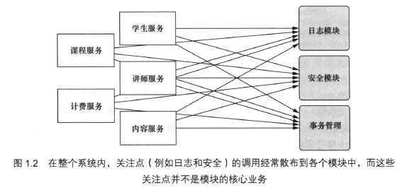
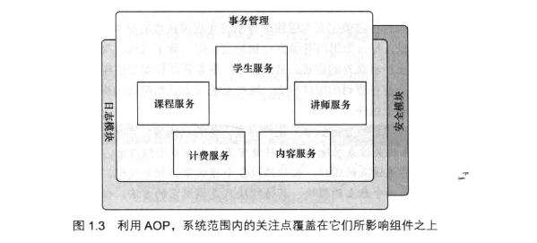

# [Spring实战（第4版）](../../../../)

## [第1部分 Spring的核心](../../../)

### [第1章 Spring之旅](../../)

#### [1.1 简化Java开发](../)

##### 1.1.3 应用切面

**DI能够让相互协作的软件组件保持松散耦合，而面向切面编程（aspect-oriented programming，AOP）允许你把遍布应用各处的功能分离出来形成可重用的组件。**

面向切面编程往往被定义为促使软件系统实现关注点分离的一项技术。如日志、事务管理和安全这样的系统服务经常融入到自身具有核心业务逻辑的组件中去，这些系统服务通常被称为横切关注点，因为它们会跨越系统的多个组件。

如果将这些关注点分散到多个组件中去，你的代码将会带来双重的复杂性。

- 实现系统关注点功能的代码将会重复出现在多个组件中。这意味着如果你要改变这些关注点的逻辑，必须修改各个模块中的相关实现。即使是你把这些关注点抽象为一个独立的模块，其他模块只是调用它的方法，但方法的调用还是会重复出现在各个模块中。

- 组件会因为那些与自身核心业务无关的代码而变得混乱。一个向地址簿增加地址条目的方法应该只关注如何添加地址，而不应该关注它是不是安全的或者是否需要支持事务。

图1.2展示了这种复杂性。左边的业务对象与系统级服务结合得过于紧密。每个对象不但要知道它需要记日志、进行安全控制和参与事务，还要亲自执行这些服务。



图1.3展示了AOP后模块的组成。这是一个非常强大的理念，可以将安全、事务和日志关注点与核心业务逻辑分离。



**AOP应用**

假设我们需要使用吟游诗人这个服务类来记载骑士的所有事迹。程序清单1.9展示了我们会使用的Minstrel类。

> 程序清单1.9 吟游诗人使中世纪的音乐记录器
```Java
package com.springinaction.knights;

import java.io.PrintStream;

public class Minstrel {
    private PrintStream stream;

    public Minstrel(PrintStream stream) {
        this.stream = stream;
    }

    /**
    * 探险之前调用
    */
    public void singBeforeQuest() {
        stream.println("Fa la la, the knight is so brave!");
    }

    /**
    * 探险之后调用
    */
    public void singAfterQuest() {
        stream.println("Tee hee hee, the brave knight " + "did embark on a quest!");
    }
}
```

程序清单1.10展示了将BraveKnight和Minstrel组合起来的第一次尝试。

> 程序清单1.10 BraveKnight必须要调用Minstrel的方法
```Java
package com.springinaction.knights;

import java.io.PrintStream;

public class BraveKnight implements Knight {
    
    private Quest quest;
    private Minstrel minstrel;

    public BraveKnight(Quest quest, Minstrel minstrel) {
        this.quest = quest;
        this.minstrel = minstrel;
    }

    public void embarkOnQuest() throws QuestException {
        // Knight应该管理它的Minstrel吗？
        minstrel.singBeforeQuest();
        quest.embark();
        minstrel.singAfterQuest();
    }
}
```

**这样会使BraveKnight变得复杂，正确的做法是把Minstrel声明为一个切面。**

程序清单1.11是更新后的knights.xml文件，Minstrel被声明为一个切面。

> 程序清单1.11 将Minstrel声明为一个切面
```xml
<?xml version="1.0" encoding="UTF-8">
<beans xmlns="http://www.springframework.org/schema/beans" xmlns:xsi="http://www.w3.org/2001/XMLSchema-instance" xsi:schemaLocation="http://www.springframework.org/schema/beans https://www.springframework.org/schema/beans/spring-beans.xsd">
    <bean id="knight" class="com.springinaction.knights.BraveKnight">
        <!-- 注入Quest bean -->
        <constructor-arg ref="quest" /> 
    </bean>
    <bean id="quest" class="com.springinaction.knights.SlayDragonQuest">
        <!-- 创建SlayDragonQuest -->
        <constructor-arg value="#{T(System).out)}" />
    </bean>
    <!-- 声明Minstrel bean -->
    <bean id="minstrel" class="com.springinaction.knights.Minstrel">
        <constructor-arg value="#{T(System).out)}" />
    </bean>

    <aop:config>
        <aop:aspect ref="minstrel">
            <!-- 定义切点 -->
            <aop:pointcut id="embark" expression="execution(* *.embarkOnQuest(...))"/>
            <!-- 声明前置通知 -->
            <aop:before pointcut-ref="embark" method="singBeforeQuest"/>
            <!-- 声明后置通知 -->
            <aop:after pointcut-ref="embark" method="singAfterQuest"/>
        </aop:aspect>
    </aop:config>
</beans>
```

expression的表达式采用的是AspectJ的切点表达式语言。现在就不需要再显式的在BraveKnight中调用Minstrel。