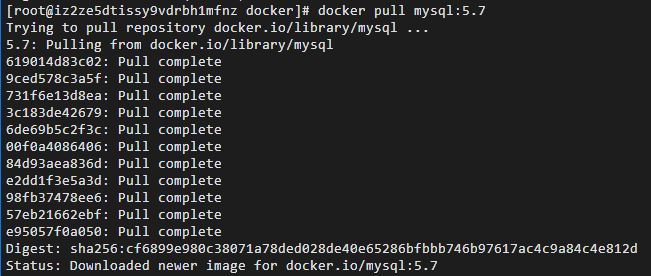
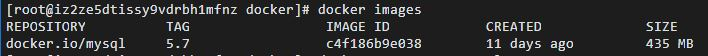
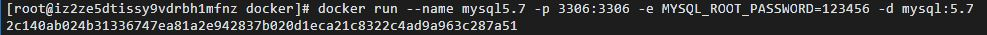
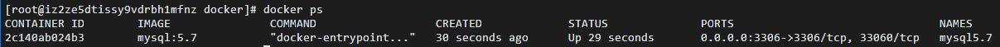

# 在docker中部署MySQL5.7

## 2020/02/13

1. 进入Linux后，使用Docker命令下载MySQL
```shell
docker pull mysql:5.7
```


2. 查看本机都有哪些镜像
```shell
docker images
```


3. 启动我们的mysql的docker容器
```shell
docker run --name mysql5.7 -p 3306:3306 -e MYSQL_ROOT_PASSWORD=123456 -d mysql:5.7
```


4. 查看已经运行的的所有容器
```shell
docker ps
```
