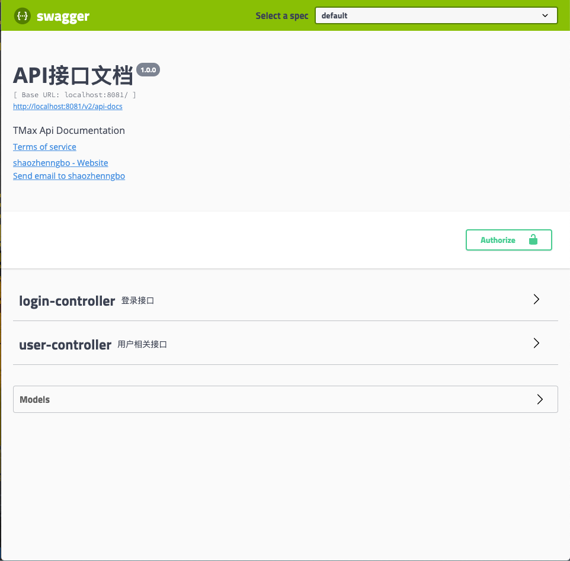
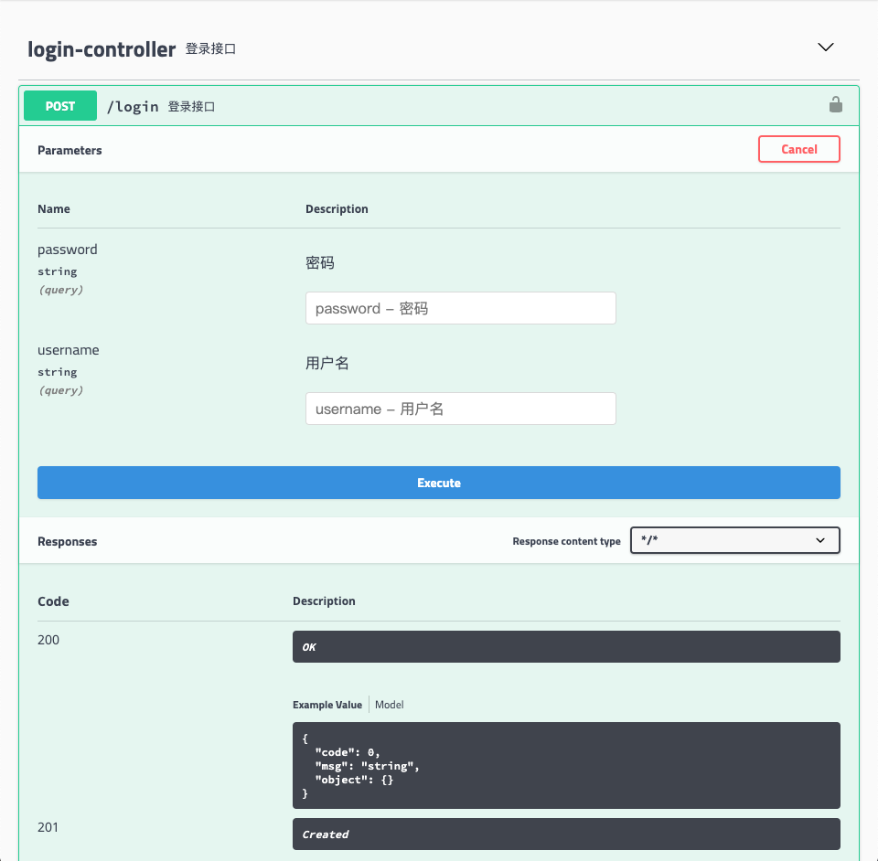

# Spring boot整合Swagger2

## 关于Swagger

### Swagger 是一个规范和完整的框架，用于生成、描述、调用和可视化 RESTful 风格的 Web 服务。<br>相信采用 Spring Boot 开发的小伙伴几乎是用来构建 RESTful API，而文档自然是不可缺少的一部分，Swagger的出现，既可以减少我们创建文档的工作量，同时说明内容又整合入实现代码中，让维护文档和修改代码整合为一体，可以让我们在修改代码逻辑的同时方便的修改文档说明。<br>另外Swagger2也提供了强大的页面测试功能来调试每个RESTful API。<br>

## 集成步骤

### 1.添加依赖

<p>pom.xml</p>

```xml
<dependency>
    <groupId>io.springfox</groupId>
    <artifactId>springfox-swagger-ui</artifactId>
    <version>2.9.2</version>
</dependency>
<dependency>
    <groupId>io.springfox</groupId>
    <artifactId>springfox-swagger2</artifactId>
    <version>2.9.2</version>
</dependency>
```

### 2.配置Swagger

<p>application.yml</p>

```yml
# Swagger界面内容配置
swagger:
  title: API接口文档
  description: TMax Api Documentation
  version: 1.0.0
  termsOfServiceUrl: https://github.com/vue-springboot-money/bysj_vue_springboot
  contact:
    name: shaozhenngbo
    url: https://github.com/vue-springboot-money/bysj_vue_springboot
    email: shaoISzhengbo@163.com
```

<p>Swagger2Config.java</p>

#### 新建一个 Swagger2Config.java 的配置类：<br>添加 @Configuration 注解，用于定义配置类，方便被Spring Boot配置；<br>添加 @EnableSwagger2 注解启动 Swagger 文档构建能力。

```java
package com.example.config;

import java.util.ArrayList;
import java.util.List;

import org.springframework.beans.factory.annotation.Value;
import org.springframework.context.annotation.Bean;
import org.springframework.context.annotation.Configuration;

import io.swagger.annotations.ApiOperation;
import lombok.extern.slf4j.Slf4j;
import springfox.documentation.builders.ApiInfoBuilder;
import springfox.documentation.builders.PathSelectors;
import springfox.documentation.builders.RequestHandlerSelectors;
import springfox.documentation.service.ApiInfo;
import springfox.documentation.service.ApiKey;
import springfox.documentation.service.AuthorizationScope;
import springfox.documentation.service.Contact;
import springfox.documentation.service.SecurityReference;
import springfox.documentation.spi.DocumentationType;
import springfox.documentation.spi.service.contexts.SecurityContext;
import springfox.documentation.spring.web.plugins.Docket;
import springfox.documentation.swagger2.annotations.EnableSwagger2;

@Slf4j
@Configuration
@EnableSwagger2
public class Swagger2Config {

    @Value("${swagger.title}")
    private String title;

    @Value("${swagger.description}")
    private String description;

    @Value("${swagger.version}")
    private String version;

    @Value("${swagger.termsOfServiceUrl}")
    private String termsOfServiceUrl;

    @Value("${swagger.contact.name}")
    private String name;

    @Value("${swagger.contact.url}")
    private String url;

    @Value("${swagger.contact.email}")
    private String email;

    private List<ApiKey> securitySchemes() {
        List<ApiKey> apiKeys = new ArrayList<>();
        apiKeys.add(new ApiKey("Authorization", "accessToken", "header"));
        return apiKeys;
    }

    private List<SecurityContext> securityContexts() {
        List<SecurityContext> securityContexts = new ArrayList<>();
        securityContexts.add(SecurityContext.builder()
                .securityReferences(defaultAuth())
                .forPaths(PathSelectors.regex("^(?!auth).*$")).build());
        return securityContexts;
    }

    private List<SecurityReference> defaultAuth() {
        AuthorizationScope authorizationScope = new AuthorizationScope("global", "accessEverything");
        AuthorizationScope[] authorizationScopes = new AuthorizationScope[1];
        authorizationScopes[0] = authorizationScope;
        List<SecurityReference> securityReferences = new ArrayList<>();
        securityReferences.add(new SecurityReference("Authorization", authorizationScopes));
        return securityReferences;
    }

    @Bean
    public Docket createRestApi() {

        log.info("load Swagger2");

        return new Docket(DocumentationType.SWAGGER_2)
            .apiInfo(apiInfo()).select()
            // 扫描所有有注解的api，用这种方式更灵活
            .apis(RequestHandlerSelectors.withMethodAnnotation(ApiOperation.class))
            .paths(PathSelectors.any())
            .build()
            .securitySchemes(securitySchemes())
            .securityContexts(securityContexts());
    }

    private ApiInfo apiInfo() {
        return new ApiInfoBuilder()
                .title(title)
                .description(description)
                .termsOfServiceUrl(termsOfServiceUrl)
                .contact(new Contact(name, url, email))
                .version(version)
                .build();
    }
}
```

#### 方法讲解：<br>通过 createRestfulApiDocs() 方法创建 Docket 的 Bean 之后，apiInfo() 用来创建该 API 的基本信息。（这些基本信息会展现在文档页面中，如最开始的预览图，增加一些文档自定义信息）<br>select() 函数返回一个 ApiSelectorBuilder 实例用来控制哪些接口暴露给Swagger 来展现，本例采用扫描所有带有 API 注解的对外开放，同时，你也可以采用指定扫描的包路径来定义，Swagger 则会扫描该包下所有 Controller定义的 API，并产生文档内容（除了被@ApiIgnore指定的请求）。<br>如果采用扫描指定包路径的话，需要修改 createRestApi() 方法的 apis 部分：

```java
.apis(RequestHandlerSelectors.basePackage("com.example.controller"))
```

### 3.给Entity、Dto、Controller添加注解

<p>TbUser.java</p>

```java
@Data
@ApiModel("用户")
@AllArgsConstructor
public class TbUser {
	@ApiModelProperty(value = "id")
	private Long id;
	
	@ApiModelProperty(value = "用户名")
	private String username;
	
	@ApiModelProperty(value = "密码")
	private String password;
	
	@ApiModelProperty(value = "用户类型（0: 管理员, 1: 学生, 2: 教师）")
	private byte type;
}
```

<p>LoginDto.java</p>

```java
@Data
@AllArgsConstructor
@ApiModel("登录")
public class LoginDto {
	// 用户名
	@ApiModelProperty(value = "用户名")
	private String username;
	
	// 密码
	@ApiModelProperty(value = "密码")
	private String password;
}
```

<p>LoginController.java</p>

```java
@RestController
@Slf4j
@Api(description = "登录接口")
@Transactional
public class LoginController {
	
	@Autowired
	private LoginService loginService;

	@PostMapping("login")
	@ApiOperation("登录接口")
	public ResultPojo login(@ModelAttribute LoginDto user) {
		TbUser result = loginService.login(user);
		
		if (result == null) {
			return new ResultPojo(Common.Http.SUCCESS, "用户名/密码错误", user);
		} else {
			return new ResultPojo(Common.Http.SUCCESS, "登陆成功", result);
		}
	}
}
```

<p>UserController.java</p>

```java
@RestController()
@Slf4j
@Api(description = "用户相关接口")
@Transactional
public class UserController {

	@Autowired
	private UserService userService;

	/**
	 * 创建用户
	 * 
	 * @param tbUser
	 * @return
	 */
	@PostMapping("user")
	@ApiOperation("创建用户")
	public ResultPojo add(@ModelAttribute TbUser tbUser) {

		TbUser result = userService.createUser(tbUser);

		if (result == null) {
			return new ResultPojo(Common.Http.SUCCESS, "创建用户失败", tbUser);
		} else {
			return new ResultPojo(Common.Http.SUCCESS, "创建用户成功", result);
		}
	}

	/**
	 * 查询所有用户
	 * 
	 * @return
	 */
	@GetMapping("user")
	@ApiOperation("查询所有用户")
	public ResultPojo findAllUser() {
		List<TbUser> result = userService.findAllUser();
		return new ResultPojo(Common.Http.SUCCESS, "查询成功", result);
	}

	/**
	 * 根据id查询用户
	 * 
	 * @param id
	 * @return
	 */
	@GetMapping("user/id/{id}")
	@ApiOperation("根据id查询用户")
	public ResultPojo findUserById(@PathVariable("id") Long id) {
		TbUser result = userService.findUserById(id);
		return new ResultPojo(Common.Http.SUCCESS, "查询成功", result);
	}

	/**
	 * 根据username查询用户
	 * 
	 * @param username
	 * @return
	 */
	@GetMapping("user/username/{username}")
	@ApiOperation("根据username查询用户")
	public ResultPojo findUserByUsername(@PathVariable("username") String username) {
		List<TbUser> result = userService.findUserByUsername(username);
		return new ResultPojo(Common.Http.SUCCESS, "查询成功", result);
	}

	/**
	 * 根据type查询用户
	 * 
	 * @param type
	 * @return
	 */
	@GetMapping("user/type/{type}")
	@ApiOperation("根据type查询用户")
	public ResultPojo findUserByType(@PathVariable("type") byte type) {
		List<TbUser> result = userService.findUserByType(type);
		return new ResultPojo(Common.Http.SUCCESS, "查询成功", result);
	}

	/**
	 * 根据id删除用户
	 * 
	 * @param id
	 * @return
	 */
	@DeleteMapping("user/id/{id}")
	@ApiOperation("根据id删除用户")
	public ResultPojo deleteUserById(@PathVariable("id") Long id) {
		int result = userService.removeUser(id);

		if (result == 1) {
			return new ResultPojo(Common.Http.SUCCESS, "删除成功", id);
		} else {
			return new ResultPojo(Common.Http.SUCCESS, "删除失败", id);
		}
	}

}
```

#### 常用注解说明：

* @Api()用于类：<br>表示标识这个类是swagger的资源

* @ApiOperation()用于方法：<br>表示一个http请求的操作

* @ApiParam()用于方法，参数，字段说明：<br>表示对参数的添加元数据（说明或是否必填等）

* @ApiModel()用于类：<br>表示对类进行说明，用于参数用实体类接收

* @ApiModelProperty()用于方法，字段：<br>表示对model属性的说明或者数据操作更改

* @ApiIgnore()用于类，方法，方法参数：<br>表示这个方法或者类被忽略

* @ApiImplicitParam() 用于方法：<br>表示单独的请求参数

* ApiImplicitParams() 用于方法，包含多个 @ApiImplicitParam

#### 项目启动后访问：http://localhost:8080/swagger-ui.html



