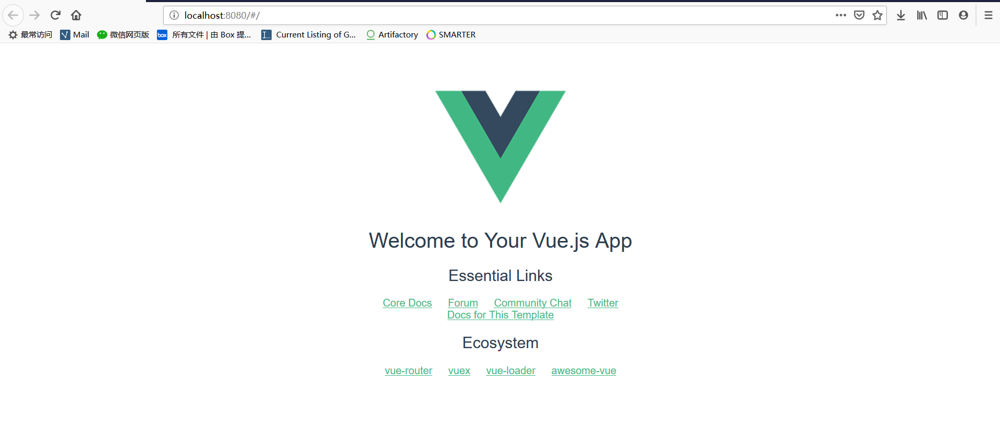

# 初始化一个webpack模板的vue项目

## 1.事前准备

1. node.js
2. vue-cli

## 2.创建项目

```shell
vue init webpack project_name
```

```shell
> # 项目名
> Project name (information_studio_admin)
> # 项目描述
> Project description (A Vue.js project)
> # 作者信息
> Author (Shao Zheng Bo <shaoISzhengbo@163.com>)
> # build模式（大部分都是runtime）
> Vue build (Use arrow keys)
> # 是否使用路由
> Install vue-router? (Y/n) 
> # 是否使用ESLint来校验代码（技术一般慎选）
> Use ESLint to lint your code? (Y/n) 
> # 选择ESLint模式
> Pick an ESLint preset Standard
> # 是否使用单元测试
> Set up unit tests (Y/n) 
> # 是否使用Nightwatch进行e2e测试
> Setup e2e tests with Nightwatch? (Y/n) 
> # 使用yarn还是npm进行包管理
> Should we run `npm install` for you after the project has been created? (recommended) npm
```

## 3.目录结构如下

```
project
└───build
│   │   build.js
│   │   check-version.js
│   │   logo.png
│   │   utils.js
│   │   vue-loader.conf.js
│   │   webpack.base.conf.js
│   │   webpack.dev.conf.js
│   │   webpack.prod.conf.js
└───config
│   │   dev.env.js
│   │   index.js
│   │   prod.env.js
└───src
│   └───config
│   │   └───assets
│   │   │   │   logo.png
│   │   └───components
│   │   │   │   HelloWorld.vue
│   │   └───router
│   │   │   │   index.js
│   │   App.vue
│   │   main.js
└───static
│   │   .gitkeep
│   index.html
│   package.json
│   README.md
```

## 4.预览项目

```shell
cd 项目目录

npm run dev
```

